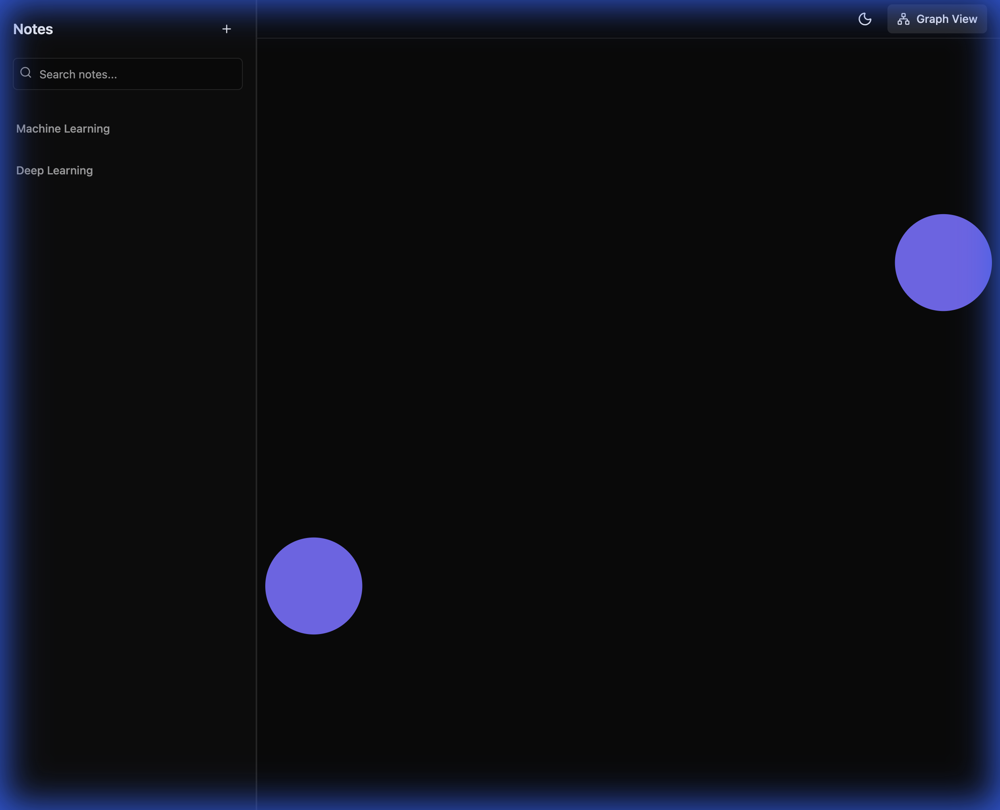
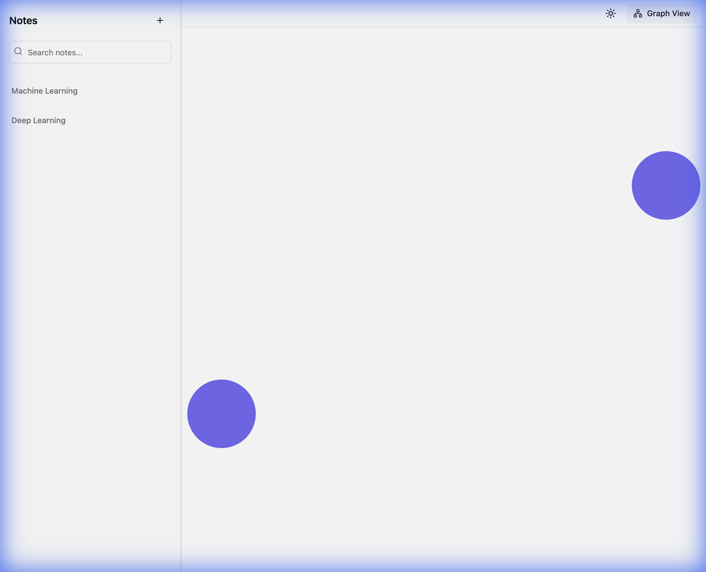
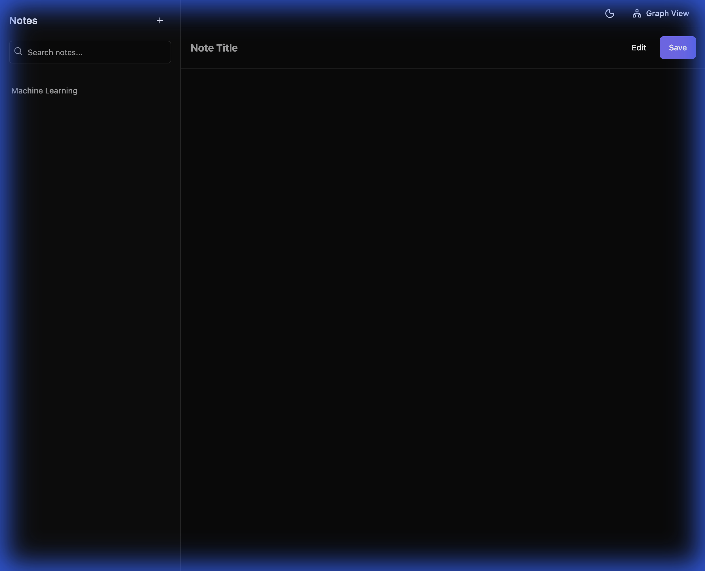

<p align="center">
  
</p>

<h1 align="center">Synapse</h1>

<p align="center">
  <strong>Connect your thoughts. Build your knowledge network.</strong>
</p>

[](https://react.dev/)
[](https://www.typescriptlang.org/)
[](https://vite.dev/)
[](https://tailwindcss.com/)
[](LICENSE)

**Synapse** is a modern, intelligent note-taking application that helps you build a personal knowledge graph. Just like synapses connect neurons in your brain, Synapse connects your ideas through bi-directional linking and interactive graph visualization.

## ✨ Features

### 📝 Smart Note-Taking
- **Markdown Support**: Write notes in Markdown with live preview
- **@Mentions**: Link notes using `@NoteName` syntax with intelligent autocomplete
- **Bi-directional Links**: Automatically creates connections between related notes
- **Real-time Preview**: Toggle between edit and preview modes instantly

### 🔗 Intelligent Linking
- **Autocomplete Dropdown**: Type `@` to see all your notes with instant search
- **Keyboard Navigation**: Use arrow keys to navigate, Enter to select, Escape to close
- **Smart Filtering**: Find notes quickly as you type with "starts with" matching
- **Clickable Mentions**: Click on `@NoteName` in preview to jump directly to that note

### 📊 Interactive Graph Visualization
- **Force-Directed Graph**: Watch your knowledge network come alive with physics-based layout
- **Node Interactions**: Click on any node to open that note instantly
- **Theme-Aware Colors**: Graph automatically adapts to light/dark mode
- **Auto-Layout**: Intelligent positioning with zoom-to-fit on load

### 🎨 Beautiful Design
- **Dark/Light Theme**: Seamless theme switching with system preference detection
- **Violet/Slate Palette**: Premium, carefully crafted color scheme
- **Responsive Layout**: Optimized for all screen sizes
- **Smooth Animations**: Polished, delightful user experience

### 💾 Local-First & Private
- **IndexedDB Storage**: All data stored securely in your browser
- **No Backend Required**: Complete privacy, zero server dependency
- **Instant Performance**: Lightning-fast operations with local storage
- **Your Data, Your Control**: Export and own your knowledge

## 🚀 Quick Start

### Prerequisites
- Node.js 18+ and npm

### Installation

```bash
# Clone the repository
git clone https://github.com/yourusername/synapse.git
cd synapse

# Install dependencies
npm install

# Start development server
npm run dev
```

Visit `http://localhost:5173` to start building your knowledge graph!

### Build for Production

```bash
npm run build
npm run preview
```

## 📸 Screenshots

### Light Mode - Graph Visualization

*Interactive force-directed graph showing the connections between your notes*

### Dark Mode - Graph Visualization

*Beautiful dark theme with adaptive graph colors for optimal visibility*

### Note Preview with @Mentions

*Clickable @mentions in preview mode - click to navigate between connected notes*

## 🎯 How It Works

### Creating Notes
1. Click the **+** button to create a new note
2. Enter a descriptive title
3. Write your content using Markdown
4. Click **Save** to persist your note

### Linking Notes with @Mentions
1. Type `@` anywhere in your note
2. An autocomplete dropdown appears with all your notes
3. Use arrow keys (↑↓) to navigate, or continue typing to filter
4. Press **Enter** to insert the mention, or **Escape** to cancel
5. The mention is inserted as `@NoteName` with automatic spacing

### Navigating Your Knowledge Graph
1. Click the **Preview** button to see rendered Markdown
2. Click any `@NoteName` mention to jump to that note
3. Click **Graph View** to visualize your entire knowledge network
4. Click any node in the graph to open that note
5. Toggle between light/dark theme with the theme button

## 🏗️ Architecture

Built with **Clean Architecture** principles for maintainability and scalability:

```
src/
├── core/              # Domain layer (entities, interfaces)
│   ├── entities.ts   # Note, Link, GraphNode, GraphData
│   └── repositories/ # Repository interfaces
├── services/          # Application layer (business logic)
│   ├── graph/        # Link extraction & graph generation
│   └── storage/      # IndexedDB implementation
├── store/            # State management (Zustand)
│   └── useNoteStore.ts
├── features/         # Feature modules
│   ├── note-editor/  # Note creation & editing
│   └── note-list/    # Note browsing & search
├── components/       # Reusable UI components
│   ├── ui/          # Base components (Button, Input, etc.)
│   └── graph/       # Graph visualization
└── layouts/          # Page layouts
```

### Technology Stack

| Technology | Purpose | Why? |
|------------|---------|------|
| **React 19** | UI framework | Latest features, better performance |
| **TypeScript** | Type safety | Catch errors early, better DX |
| **Vite** | Build tool | Lightning-fast HMR, optimized builds |
| **Tailwind CSS v4** | Styling | Utility-first, highly customizable |
| **Zustand** | State management | Lightweight, simple, powerful |
| **IndexedDB (idb)** | Local storage | Persistent, structured data storage |
| **react-force-graph-2d** | Graph viz | Interactive, physics-based layouts |
| **react-markdown** | Markdown rendering | Secure, extensible rendering |

## 🎨 Design Philosophy

- **Local-First**: Your data stays on your device
- **Privacy-Focused**: No tracking, no analytics, no servers
- **Fast & Responsive**: Instant interactions, smooth animations
- **Beautiful & Minimal**: Clean design that gets out of your way
- **Keyboard-Friendly**: Efficient workflows with keyboard shortcuts

## 🛠️ Development

### Project Setup
- **Clean Architecture**: Clear separation of concerns
- **TypeScript Strict Mode**: Maximum type safety with `verbatimModuleSyntax`
- **Path Aliases**: Clean imports with `@` prefix
- **Component-Driven**: Reusable, composable UI components

### Code Quality
```bash
# Type checking
npm run build

# Development with HMR
npm run dev
```

## 🤝 Contributing

Contributions are welcome! Feel free to:
- Report bugs
- Suggest features
- Submit pull requests
- Improve documentation

## 📄 License

MIT License - see [LICENSE](LICENSE) file for details

## 🙏 Acknowledgments

- Built with [React](https://react.dev/)
- Styled with [Tailwind CSS](https://tailwindcss.com/)
- Graph powered by [react-force-graph](https://github.com/vasturiano/react-force-graph)
- Inspired by tools like Obsidian, Roam Research, and Notion

---

<p align="center">
  <strong>Synapse</strong> - Connect your thoughts, build your knowledge network
  <br>
  Made with ❤️ and ☕
</p>
